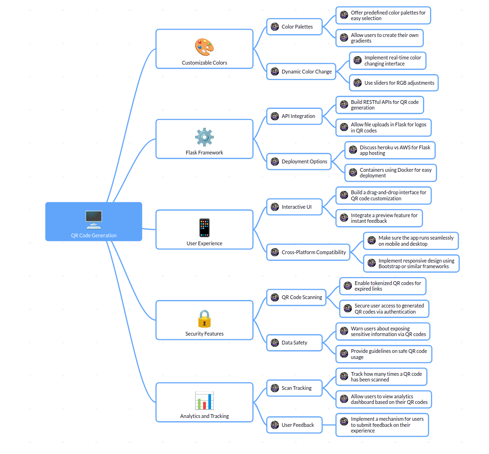

# QR Code Generator

A Flask-based web application for creating custom QR codes with branding capabilities.

## SWOT

| **Strengths** | **Weaknesses** |
|---------------|----------------|
| • Web-based solution accessible from anywhere | • Potentially limited customization compared to paid solutions |
| • Branding capabilities for business users | • May require ongoing maintenance and updates |
| • Built on Flask - lightweight and easy to deploy | • Possible performance limitations with high volume requests |
| • Simple user interface  | • Dependency on third-party QR code libraries |
| • No installation needed | • Limited offline functionality |

| **Opportunities** | **Threats** |
|-------------------|------------|
| • Growing demand for contactless interactions | • Competing QR code generator services |
| • Potential for premium features/subscription model | • Changes in QR code standards/technology |
| • Integration with other marketing tools | • Security concerns around QR code usage |
| • Mobile app extension possibility | • Free alternatives from major tech companies |
| • API offering for developers | • Possible market saturation |

## MVP

| **Features** | **MVP** | **Final Product** |
|---------------|----------------|----------------|
| User Authentication | Simple login/register functionality | Social login, password recovery, profile management |
| QR Code Generation | Basic QR code creation with URL/text input | Advanced QR code options with analytics and tracking |
| Customization | Foreground/background color selection | Logo embedding, custom shapes, design templates |
| Download Options | PNG download | Multiple formats (SVG, PDF, EPS), resolution options |
| Saving QR Codes | Basic saving to user account | Folders/categories, sharing capabilities |
| User Interface | Clean, responsive design | Advanced UI, accessibility features |
| Deployment | Web-based only | Progressive web app, native mobile apps |
| Security | Basic authentication security | Advanced encryption |
| Pricing | Simulation | Monthly plan with removing ads and unlimited qrcode generatings |
